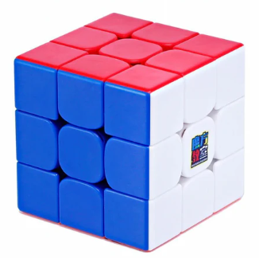

# My Summer 2024

## Gabriel Bonilla 

## Introduction

### Hello! My name is Gabriel Bonilla and I am 15 years old. I am in 10th grade and I love playing soccer. 

## Summer Activities
### 1. Some activities that I did over the summer was go to Lake Tahoe. I Paddleboarded which was really cool and I jumped off a rock into the water which was my higlight. Another thing I did was go bowling which was really fun. 

## New Skils
### 2. Some new skills I learned/ mastered was a rubix cube. I recently mastered it after 3 years and I am able to solve it with ease in less than 40 secs. Another skkill

## Summer Food
### 3. My favorite summer food this summer was definitly my moms Pozole. It was a really good treat after some exercise and I really enjoyed eating it. 

## Favorite Summer Memory with Freinds
### 4. My Favorite Summer memory with my freinds was going to thwe pool with them and watching a movie. I really liked swimming and play ball with them in the pool. We also ate and it was a very fun time. 

## Most Memorable Expirience
### 5. My most memorable expirience was the trip we took to Lake tahoe since it was so fun and I hope to do it again next year. I had lots of joy swimming since it is something I loved since a kid. 

